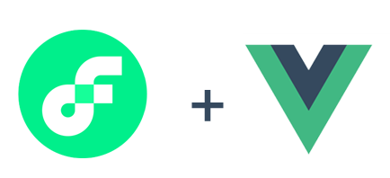
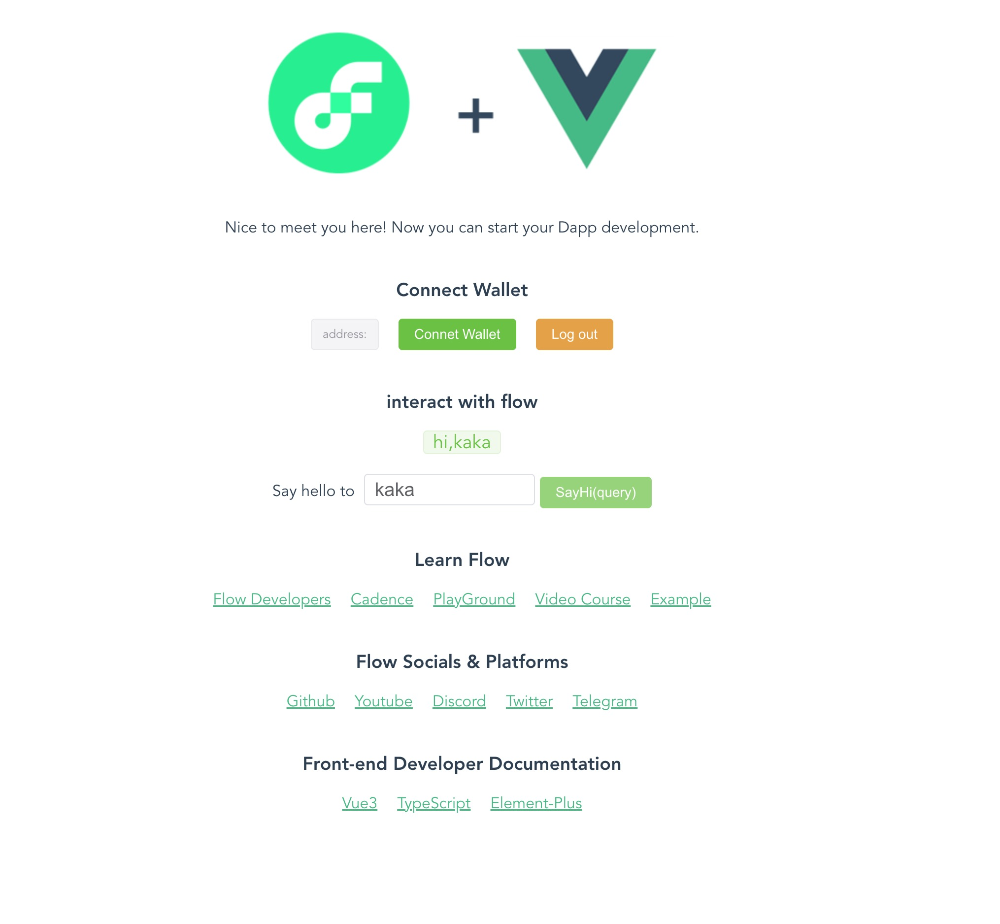

<p align="center">
  <a href="https://flow.com/">
    
  </a>
</p>
- flow_vue3_elementplus_scaffolding: is an integrated Flow, Vue3, ElementPlus web application scaffolding that can help you quickly get into Flow DApp project development.

-  For more information about Flow, see:: [Flow Website](https://flow.com/) <br/> 

## 1. Prerequisites
Make sure you have installed all of the following prerequisites on your development machine:

- Node.js - [Download & Install Node.js](https://nodejs.org/)  and the npm package manager.
- Install the latest version of vue-cli
```sh
   npm install -g @vue/cli
```
 - To view the vue-cli version, you need to install version 3.x or above
```sh
   vue -V
```
 - If you are a low-level version, you can uninstall vue-cli after installing it globally, and then reinstall it.
```sh
   npm uninstall -g @vue/cli
```


## 2. Clone the project
```sh
git clone https://github.com/28356715/flow_vue3_elementplus_scaffolding.git
```


## 3. IDE
- VSCode - [Download & Install VSCode.](https://code.visualstudio.com/) <br/>
- Install the plug-in in VSCode: cadence

## 4. Project setup
```sh
npm install
```

### Compiles and hot-reloads for development
```sh
npm run serve
```

### Compiles and minifies for production
```
npm run build
```

When you see the following page, congratulations, you've made it. Start your pleasant trip!


